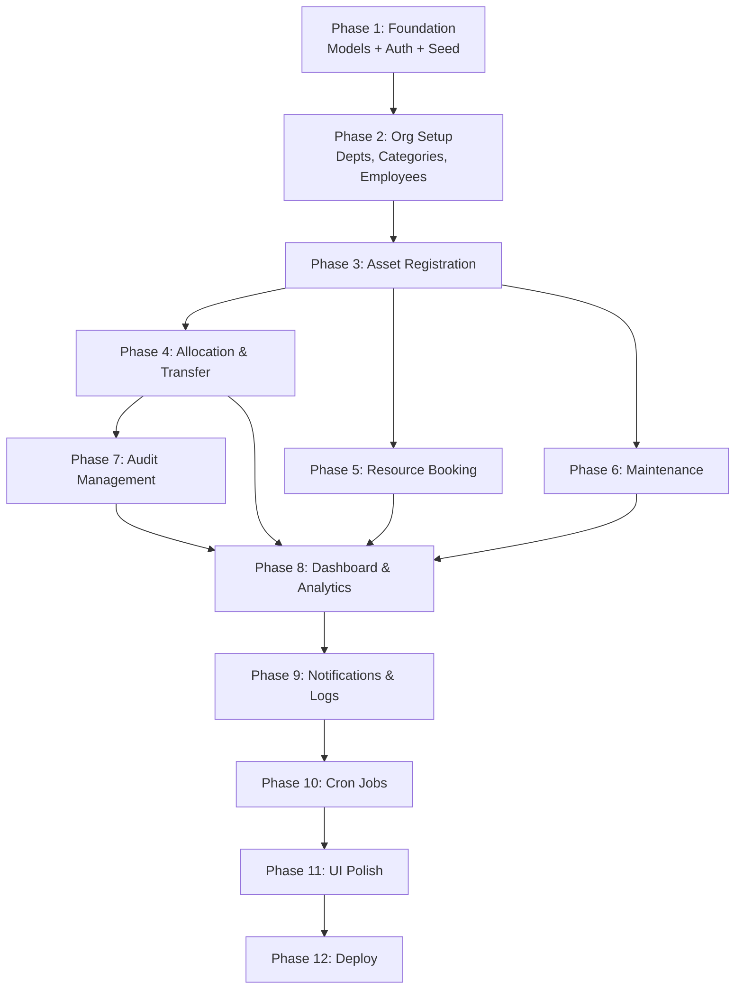

# AssetFlow — Full MERN Stack Implementation Plan

> Enterprise Asset & Resource Management System — Hackathon Build

## ERD Reference


---

## Tech Stack (Final)

| Layer | Technology |
|---|---|
| **Frontend** | React 18 (Vite) + Ant Design + Recharts + FullCalendar |
| **Backend** | Node.js 20 + Express.js + Mongoose |
| **Database** | MongoDB Atlas (free tier) |
| **Auth** | JWT (access + refresh tokens) + bcrypt |
| **File Uploads** | Multer + Cloudinary |
| **Scheduling** | node-cron (overdue checks, reminders) |
| **Deployment** | Vercel (frontend) + Render (backend) + MongoDB Atlas |

---

## Project Structure

```
assetflow/
├── client/                          # React Frontend
│   ├── public/
│   ├── src/
│   │   ├── api/                     # Axios instance + API service modules
│   │   │   ├── axios.js             # Base axios config with interceptors
│   │   │   ├── auth.api.js
│   │   │   ├── department.api.js
│   │   │   ├── employee.api.js
│   │   │   ├── category.api.js
│   │   │   ├── asset.api.js
│   │   │   ├── allocation.api.js
│   │   │   ├── transfer.api.js
│   │   │   ├── booking.api.js
│   │   │   ├── maintenance.api.js
│   │   │   ├── audit.api.js
│   │   │   ├── notification.api.js
│   │   │   ├── activityLog.api.js
│   │   │   └── report.api.js
│   │   ├── components/              # Reusable UI components
│   │   │   ├── common/              # Buttons, Modals, StatusBadge, etc.
│   │   │   ├── layout/              # AppLayout, Sidebar, Header, RoleGuard
│   │   │   └── charts/              # KPI cards, heatmaps, trend charts
│   │   ├── pages/                   # One folder per screen
│   │   │   ├── Login/
│   │   │   ├── Dashboard/
│   │   │   ├── OrganizationSetup/   # 3 tabs: Departments, Categories, Employees
│   │   │   ├── AssetDirectory/
│   │   │   ├── AssetAllocation/
│   │   │   ├── ResourceBooking/
│   │   │   ├── Maintenance/
│   │   │   ├── AuditManagement/
│   │   │   ├── Reports/
│   │   │   └── Notifications/
│   │   ├── context/                 # AuthContext (user, token, role)
│   │   ├── hooks/                   # useAuth, useNotifications, useDebounce
│   │   ├── utils/                   # Constants, formatters, role helpers
│   │   ├── routes/                  # Route config + ProtectedRoute component
│   │   ├── App.jsx
│   │   ├── App.css
│   │   └── main.jsx
│   ├── index.html
│   ├── vite.config.js
│   └── package.json
│
├── server/                          # Express Backend
│   ├── config/
│   │   ├── db.js                    # MongoDB connection
│   │   ├── cloudinary.js            # Cloudinary config
│   │   └── constants.js             # Enums, status values
│   ├── models/                      # Mongoose schemas (1:1 with ERD)
│   │   ├── Role.js
│   │   ├── Department.js
│   │   ├── Employee.js
│   │   ├── UserSession.js
│   │   ├── AssetCategory.js
│   │   ├── Asset.js
│   │   ├── AssetAllocation.js
│   │   ├── TransferRequest.js
│   │   ├── Booking.js
│   │   ├── MaintenanceRequest.js
│   │   ├── AuditCycle.js
│   │   ├── AuditRecord.js
│   │   ├── Notification.js
│   │   └── ActivityLog.js
│   ├── routes/                      # Express routers
│   │   ├── auth.routes.js
│   │   ├── department.routes.js
│   │   ├── employee.routes.js
│   │   ├── category.routes.js
│   │   ├── asset.routes.js
│   │   ├── allocation.routes.js
│   │   ├── transfer.routes.js
│   │   ├── booking.routes.js
│   │   ├── maintenance.routes.js
│   │   ├── audit.routes.js
│   │   ├── notification.routes.js
│   │   ├── activityLog.routes.js
│   │   └── report.routes.js
│   ├── controllers/                 # Request handlers (mirror routes)
│   │   ├── auth.controller.js
│   │   ├── department.controller.js
│   │   ├── employee.controller.js
│   │   ├── category.controller.js
│   │   ├── asset.controller.js
│   │   ├── allocation.controller.js
│   │   ├── transfer.controller.js
│   │   ├── booking.controller.js
│   │   ├── maintenance.controller.js
│   │   ├── audit.controller.js
│   │   ├── notification.controller.js
│   │   ├── activityLog.controller.js
│   │   └── report.controller.js
│   ├── middleware/
│   │   ├── auth.middleware.js        # JWT verification
│   │   ├── role.middleware.js        # Role-based access control
│   │   ├── upload.middleware.js      # Multer config
│   │   ├── validate.middleware.js    # Joi validation runner
│   │   └── activityLog.middleware.js # Auto-log actions
│   ├── validators/                   # Joi schemas per entity
│   │   ├── auth.validator.js
│   │   ├── asset.validator.js
│   │   ├── booking.validator.js
│   │   └── ...
│   ├── services/                     # Business logic layer
│   │   ├── asset.service.js
│   │   ├── allocation.service.js
│   │   ├── booking.service.js
│   │   ├── maintenance.service.js
│   │   ├── audit.service.js
│   │   └── notification.service.js
│   ├── jobs/                         # Cron jobs
│   │   ├── overdueChecker.js         # Flag overdue allocations
│   │   ├── bookingReminder.js        # Send booking reminders
│   │   └── index.js                  # Register all cron jobs
│   ├── utils/
│   │   ├── assetTagGenerator.js      # Auto-generate AF-0001, AF-0002...
│   │   ├── responseHelper.js         # Standardized API responses
│   │   └── emailHelper.js            # Optional email notifications
│   ├── seed/
│   │   └── seed.js                   # Seed roles + default admin
│   ├── server.js                     # Entry point
│   └── package.json
│
├── .env.example
├── .gitignore
└── README.md
```

---

## Phase 1: Foundation (Backend Core + Auth)

> **Goal**: MongoDB connected, all 14 Mongoose models created, auth working, seed script ready.

### Step 1.1 — Project Scaffolding

- [ ] Initialize `server/` with `npm init`, install dependencies:
  ```
  express mongoose dotenv cors bcryptjs jsonwebtoken joi multer cloudinary
  node-cron morgan helmet express-rate-limit
  ```
- [ ] Initialize `client/` with Vite:
  ```
  npx -y create-vite@latest ./ --template react
  ```
- [ ] Install frontend deps:
  ```
  antd @ant-design/icons @ant-design/charts react-router-dom axios
  dayjs recharts @fullcalendar/react @fullcalendar/daygrid
  @fullcalendar/timegrid @fullcalendar/interaction react-toastify jspdf xlsx
  ```
- [ ] Configure `.env` with `MONGO_URI`, `JWT_SECRET`, `JWT_REFRESH_SECRET`, `CLOUDINARY_*`
- [ ] Set up `server/config/db.js` for Mongoose connection
- [ ] Set up `server/server.js` with Express, CORS, middleware pipeline

### Step 1.2 — Mongoose Models (All 14, matching ERD exactly)

Every model maps 1:1 to the ERD entities:

#### `Role.js`
```js
{
  name: { type: String, enum: ['Admin', 'Asset Manager', 'Department Head', 'Employee'], required: true },
  description: String,
  created_at: { type: Date, default: Date.now }
}
```

#### `Department.js`
```js
{
  name: { type: String, required: true },
  parent_department_id: { type: ObjectId, ref: 'Department', default: null },
  head_employee_id: { type: ObjectId, ref: 'Employee', default: null },
  status: { type: String, enum: ['Active', 'Inactive'], default: 'Active' },
  created_at: Date, updated_at: Date
}
```

#### `Employee.js`
```js
{
  name: { type: String, required: true },
  email: { type: String, unique: true, required: true },
  password_hash: { type: String, required: true },
  department_id: { type: ObjectId, ref: 'Department' },
  role_id: { type: ObjectId, ref: 'Role', required: true },
  status: { type: String, enum: ['Active', 'Inactive'], default: 'Active' },
  created_at: Date, updated_at: Date
}
```

#### `UserSession.js`
```js
{
  employee_id: { type: ObjectId, ref: 'Employee', required: true },
  token: { type: String, unique: true, required: true },
  login_at: { type: Date, default: Date.now },
  logout_at: Date,
  ip_address: String,
  user_agent: String
}
```

#### `AssetCategory.js`
```js
{
  name: { type: String, required: true },
  description: String,
  custom_fields: { type: Schema.Types.Mixed, default: {} },  // JSON: e.g. { warranty_period: "2 years" }
  created_at: Date, updated_at: Date
}
```

#### `Asset.js`
```js
{
  category_id: { type: ObjectId, ref: 'AssetCategory', required: true },
  asset_tag: { type: String, unique: true, required: true },      // Auto: AF-0001
  serial_number: { type: String, unique: true },
  name: { type: String, required: true },
  description: String,
  is_bookable: { type: Boolean, default: false },
  condition: { type: String, enum: ['New', 'Good', 'Fair', 'Poor'] },
  status: { type: String, enum: ['Available','Allocated','Reserved','Under Maintenance','Lost','Retired','Disposed'], default: 'Available' },
  location: String,
  acquisition_date: Date,
  acquisition_cost: Number,
  photo_url: String,
  created_by: { type: ObjectId, ref: 'Employee' },
  created_at: Date, updated_at: Date
}
```

#### `AssetAllocation.js`
```js
{
  asset_id: { type: ObjectId, ref: 'Asset', required: true },
  employee_id: { type: ObjectId, ref: 'Employee' },
  department_id: { type: ObjectId, ref: 'Department' },
  allocated_by: { type: ObjectId, ref: 'Employee', required: true },
  allocated_date: { type: Date, default: Date.now },
  expected_return_date: Date,
  returned_date: Date,
  status: { type: String, enum: ['Active', 'Returned', 'Overdue'], default: 'Active' },
  condition_on_return: String,
  return_notes: String,
  created_at: Date, updated_at: Date
}
```

#### `TransferRequest.js`
```js
{
  allocation_id: { type: ObjectId, ref: 'AssetAllocation', required: true },
  from_employee_id: { type: ObjectId, ref: 'Employee', required: true },
  to_employee_id: { type: ObjectId, ref: 'Employee', required: true },
  requested_by: { type: ObjectId, ref: 'Employee', required: true },
  status: { type: String, enum: ['Requested', 'Approved', 'Rejected'], default: 'Requested' },
  requested_at: { type: Date, default: Date.now },
  approved_by: { type: ObjectId, ref: 'Employee' },
  approved_at: Date,
  remarks: String
}
```

#### `Booking.js`
```js
{
  asset_id: { type: ObjectId, ref: 'Asset', required: true },    // bookable asset
  employee_id: { type: ObjectId, ref: 'Employee', required: true },
  start_datetime: { type: Date, required: true },
  end_datetime: { type: Date, required: true },
  purpose: String,
  status: { type: String, enum: ['Confirmed', 'Cancelled', 'Completed'], default: 'Confirmed' },
  created_at: Date,
  created_by: { type: ObjectId, ref: 'Employee' },
  photo_url: String
}
```

#### `MaintenanceRequest.js`
```js
{
  asset_id: { type: ObjectId, ref: 'Asset', required: true },
  requested_by: { type: ObjectId, ref: 'Employee', required: true },
  issue_description: { type: String, required: true },
  priority: { type: String, enum: ['Low', 'Medium', 'High'], default: 'Medium' },
  status: { type: String, enum: ['Pending Approval','Approved','In Progress','Resolved','Closed'], default: 'Pending Approval' },
  photo_url: String,
  requested_at: { type: Date, default: Date.now },
  approved_by: { type: ObjectId, ref: 'Employee' },
  technician_id: { type: ObjectId, ref: 'Employee' },
  approved_at: Date,
  resolved_at: Date,
  resolution_notes: String
}
```

#### `AuditCycle.js`
```js
{
  name: { type: String, required: true },
  scope_department_id: { type: ObjectId, ref: 'Department' },
  scope_location: String,
  start_date: Date,
  end_date: Date,
  status: { type: String, enum: ['Planned', 'In Progress', 'Completed', 'Closed'], default: 'Planned' },
  created_by: { type: ObjectId, ref: 'Employee' },
  created_at: Date, updated_at: Date
}
```

#### `AuditRecord.js`
```js
{
  audit_cycle_id: { type: ObjectId, ref: 'AuditCycle', required: true },
  asset_id: { type: ObjectId, ref: 'Asset', required: true },
  auditor_id: { type: ObjectId, ref: 'Employee', required: true },
  result: { type: String, enum: ['Verified', 'Missing', 'Damaged', 'Not Working', 'Others'] },
  remarks: String,
  recorded_at: { type: Date, default: Date.now },
  photo_url: String
}
```

#### `Notification.js`
```js
{
  employee_id: { type: ObjectId, ref: 'Employee', required: true },
  title: { type: String, required: true },
  message: String,
  type: { type: String, enum: ['Return', 'Booking', 'Maintenance', 'Audit', 'System', 'Other'] },
  is_read: { type: Boolean, default: false },
  created_at: { type: Date, default: Date.now }
}
```

#### `ActivityLog.js`
```js
{
  employee_id: { type: ObjectId, ref: 'Employee', required: true },
  action: { type: String, required: true },            // e.g. "ASSET_CREATED", "ALLOCATION_APPROVED"
  entity_type: { type: String, required: true },        // e.g. "Asset", "Booking"
  entity_id: { type: ObjectId, required: true },
  description: String,
  metadata: { type: Schema.Types.Mixed, default: {} },  // JSON: extra context
  ip_address: String
}
```

### Step 1.3 — Auth System

- [ ] **Seed script** (`seed/seed.js`): Create 4 roles + one default Admin account
- [ ] **POST `/api/auth/signup`**: Creates Employee with role = `Employee` (never Admin)
- [ ] **POST `/api/auth/login`**: Validates credentials → returns JWT (access + refresh) → creates `UserSession`
- [ ] **POST `/api/auth/logout`**: Invalidates session, sets `logout_at`
- [ ] **POST `/api/auth/refresh`**: Refresh token rotation
- [ ] **POST `/api/auth/forgot-password`**: Reset token via email (or mock for hackathon)
- [ ] **Auth Middleware**: Extracts JWT → attaches `req.user` with `{ id, role, department }`
- [ ] **Role Middleware**: `authorize('Admin', 'Asset Manager')` pattern for route guarding

---

## Phase 2: Organization Setup (Admin Module)

> **Goal**: Admin can manage departments, categories, and employee roles. This is the foundation all other modules depend on.

### Step 2.1 — Department Management API

- [ ] **POST `/api/departments`** — Create department (Admin only)
- [ ] **GET `/api/departments`** — List all (with parent hierarchy + head populated)
- [ ] **PUT `/api/departments/:id`** — Edit department, assign head
- [ ] **PATCH `/api/departments/:id/status`** — Activate/deactivate
- [ ] Validate: no circular parent references, head must be Active employee

### Step 2.2 — Asset Category Management API

- [ ] **POST `/api/categories`** — Create category with optional `custom_fields` JSON
- [ ] **GET `/api/categories`** — List all categories
- [ ] **PUT `/api/categories/:id`** — Edit category
- [ ] **DELETE `/api/categories/:id`** — Soft-delete (only if no assets use it)

### Step 2.3 — Employee Directory API

- [ ] **GET `/api/employees`** — List with filters (department, role, status)
- [ ] **GET `/api/employees/:id`** — Employee detail with allocations + assets
- [ ] **PUT `/api/employees/:id`** — Edit employee info
- [ ] **PATCH `/api/employees/:id/role`** — **Admin-only**: Promote to Department Head / Asset Manager
- [ ] **PATCH `/api/employees/:id/status`** — Activate/deactivate

### Step 2.4 — Organization Setup UI (3-tab page)

- [ ] **Tab A — Departments**: Antd Table + Tree for hierarchy + Create/Edit drawer
- [ ] **Tab B — Asset Categories**: Antd Table + dynamic custom_fields form builder
- [ ] **Tab C — Employee Directory**: Antd Table with search/filter + role promotion modal
- [ ] All tabs: Admin-only route guard

---

## Phase 3: Asset Registration & Directory

> **Goal**: Register assets with auto-generated tags, full search/filter, lifecycle tracking.

### Step 3.1 — Asset APIs

- [ ] **POST `/api/assets`** — Register asset
  - Auto-generate `asset_tag` (AF-0001, AF-0002...) using a counter collection or aggregation
  - Accept photo upload via Multer → Cloudinary
- [ ] **GET `/api/assets`** — List with filters: tag, serial, category, status, department, location
- [ ] **GET `/api/assets/:id`** — Full detail + allocation history + maintenance history (aggregated)
- [ ] **PUT `/api/assets/:id`** — Edit asset details
- [ ] **PATCH `/api/assets/:id/status`** — Lifecycle transition with validation:

  ```
  Valid transitions:
  Available → Allocated, Reserved, Under Maintenance, Lost, Retired, Disposed
  Allocated → Available (via return), Under Maintenance, Lost
  Reserved → Available, Allocated
  Under Maintenance → Available
  Lost → Available (if found), Disposed
  Retired → Disposed
  ```

- [ ] **GET `/api/assets/:id/history`** — Combined allocation + maintenance timeline

### Step 3.2 — Asset Directory UI

- [ ] Asset registration form with category dropdown, photo upload, bookable toggle
- [ ] Searchable/filterable asset table with status badges (color-coded per lifecycle state)
- [ ] Asset detail drawer: info, current holder, allocation history timeline, maintenance log
- [ ] Status lifecycle indicator (visual state machine)

---

## Phase 4: Asset Allocation & Transfer

> **Goal**: Allocate assets with conflict prevention, transfer workflow, return flow, overdue flagging.

### Step 4.1 — Allocation APIs

- [ ] **POST `/api/allocations`** — Allocate asset
  - **Conflict check**: If asset has `Active` allocation → block and return current holder info
  - Set asset status → `Allocated`
  - Create `Notification` for allocated employee
  - Create `ActivityLog` entry
- [ ] **GET `/api/allocations`** — List with filters (employee, department, status, overdue)
- [ ] **POST `/api/allocations/:id/return`** — Return asset
  - Capture `condition_on_return` + `return_notes`
  - Set allocation status → `Returned`, asset status → `Available`
  - Create notification + log
- [ ] **GET `/api/allocations/overdue`** — All allocations past `expected_return_date` with status still `Active`

### Step 4.2 — Transfer APIs

- [ ] **POST `/api/transfers`** — Request transfer (from current holder or manager)
  - Validate: asset must have an active allocation
  - Status → `Requested`
- [ ] **PATCH `/api/transfers/:id/approve`** — Approve (Asset Manager / Department Head)
  - Close old allocation (status → `Returned`)
  - Create new allocation for `to_employee`
  - Update asset, create notifications for both employees
  - Status → `Approved`
- [ ] **PATCH `/api/transfers/:id/reject`** — Reject with remarks

### Step 4.3 — Allocation & Transfer UI

- [ ] Allocation form: select asset (only Available ones) + employee + optional return date
- [ ] Conflict modal: "Currently held by {employee}. Request Transfer?" button
- [ ] Active allocations table with overdue row highlighting (red)
- [ ] Return modal: condition notes + confirmation
- [ ] Transfer requests table with Approve/Reject action buttons
- [ ] Transfer timeline view

---

## Phase 5: Resource Booking

> **Goal**: Calendar-based booking of bookable assets with overlap prevention.

### Step 5.1 — Booking APIs

- [ ] **POST `/api/bookings`** — Create booking
  - Validate `is_bookable === true` on asset
  - **Overlap check**:
    ```js
    const overlap = await Booking.findOne({
      asset_id: assetId,
      status: { $ne: 'Cancelled' },
      start_datetime: { $lt: end },
      end_datetime: { $gt: start }
    });
    ```
  - If overlap → reject with conflicting booking details
  - Create notification for booker
- [ ] **GET `/api/bookings`** — List with filters (resource, date range, status, employee)
- [ ] **GET `/api/bookings/resource/:assetId`** — All bookings for a specific resource (for calendar)
- [ ] **PATCH `/api/bookings/:id/cancel`** — Cancel booking
- [ ] **PATCH `/api/bookings/:id/complete`** — Mark completed
- [ ] **PATCH `/api/bookings/:id/reschedule`** — Update times (re-run overlap check)

### Step 5.2 — Booking UI

- [ ] **FullCalendar** view showing resource bookings (day/week views)
- [ ] Booking form modal: select resource, date/time range, purpose
- [ ] Overlap error display with conflicting slot details
- [ ] Booking list with status filters and Cancel/Reschedule actions
- [ ] Color-coded events: Upcoming (blue), Ongoing (green), Completed (gray), Cancelled (red)

---

## Phase 6: Maintenance Management

> **Goal**: Raise → Approve → Assign → Resolve workflow with auto asset status updates.

### Step 6.1 — Maintenance APIs

- [ ] **POST `/api/maintenance`** — Raise request (any employee)
  - Attach photo, set priority, link to asset
  - Status → `Pending Approval`
- [ ] **GET `/api/maintenance`** — List with filters (status, priority, asset, date range)
- [ ] **PATCH `/api/maintenance/:id/approve`** — Asset Manager approves
  - Status → `Approved`, asset status → `Under Maintenance`
  - Create notification
- [ ] **PATCH `/api/maintenance/:id/reject`** — Reject with reason
- [ ] **PATCH `/api/maintenance/:id/assign`** — Assign technician
  - Status → `In Progress`
- [ ] **PATCH `/api/maintenance/:id/resolve`** — Mark resolved
  - Capture `resolution_notes`, set `resolved_at`
  - Status → `Resolved`, asset status → `Available`
- [ ] **PATCH `/api/maintenance/:id/close`** — Final closure
  - Status → `Closed`
- [ ] **GET `/api/assets/:id/maintenance`** — Maintenance history for an asset

### Step 6.2 — Maintenance UI

- [ ] Raise request form: asset picker, issue description, priority dropdown, photo upload
- [ ] Maintenance queue table with status pipeline columns
- [ ] Approval actions (for Asset Managers)
- [ ] Technician assignment dropdown
- [ ] Resolution form with notes
- [ ] Per-asset maintenance history timeline

---

## Phase 7: Audit Management

> **Goal**: Create audit cycles, assign auditors, record results, generate discrepancy reports.

### Step 7.1 — Audit APIs

- [ ] **POST `/api/audits/cycles`** — Create audit cycle (Admin only)
  - Scope by department or location, set date range
  - Status → `Planned`
- [ ] **GET `/api/audits/cycles`** — List all cycles with status
- [ ] **PATCH `/api/audits/cycles/:id/start`** — Start cycle → `In Progress`
  - Auto-generate blank `AuditRecord` for each in-scope asset
- [ ] **POST `/api/audits/cycles/:id/assign`** — Assign auditors array
- [ ] **PATCH `/api/audits/records/:id`** — Auditor records result per asset
  - Set result: `Verified` / `Missing` / `Damaged` / `Not Working` / `Others`
  - Add remarks, optional photo
- [ ] **PATCH `/api/audits/cycles/:id/complete`** — Complete cycle
  - Status → `Completed`
  - Auto-generate discrepancy report (all non-Verified records)
- [ ] **PATCH `/api/audits/cycles/:id/close`** — Close and lock cycle
  - Status → `Closed`
  - Update affected asset statuses (e.g., `Missing` → asset.status = `Lost`)
  - Create notifications for discrepancies
- [ ] **GET `/api/audits/cycles/:id/report`** — Discrepancy report (flagged items only)

### Step 7.2 — Audit UI

- [ ] Audit cycle creation form (scope, dates, auditors)
- [ ] Audit cycle list with status badges
- [ ] Auditor checklist: asset-by-asset verification form
- [ ] Discrepancy report table (auto-generated)
- [ ] Close audit confirmation with asset status update preview

---

## Phase 8: Dashboard & Analytics

> **Goal**: Role-aware KPI dashboard, reports, and exportable analytics.

### Step 8.1 — Dashboard APIs

- [ ] **GET `/api/dashboard/kpis`** — Return computed KPIs:
  - Assets Available count
  - Assets Allocated count
  - Maintenance requests today
  - Active bookings right now
  - Pending transfer requests
  - Upcoming returns (next 7 days)
  - Overdue returns
- [ ] **GET `/api/dashboard/overdue`** — Overdue allocations list
- [ ] **GET `/api/dashboard/upcoming-returns`** — Returns due within 7 days

### Step 8.2 — Reports APIs

- [ ] **GET `/api/reports/utilization`** — Asset utilization (most used vs idle)
- [ ] **GET `/api/reports/maintenance-frequency`** — By asset/category
- [ ] **GET `/api/reports/department-allocation`** — Department-wise summary
- [ ] **GET `/api/reports/booking-heatmap`** — Peak usage windows (hourly grid)
- [ ] **GET `/api/reports/assets-due`** — Assets nearing maintenance/retirement

### Step 8.3 — Dashboard & Reports UI

- [ ] **KPI cards** (Antd Statistic): color-coded, clickable for drill-down
- [ ] **Overdue alerts section** (highlighted in red)
- [ ] **Quick action buttons**: Register Asset, Book Resource, Raise Maintenance
- [ ] **Charts**: Recharts area/bar charts for utilization trends
- [ ] **Booking heatmap**: Grid showing peak times
- [ ] **Department allocation pie chart**
- [ ] **Export buttons**: PDF (jsPDF) and Excel (xlsx) per report

---

## Phase 9: Notifications & Activity Logs

> **Goal**: Real-time notification feed + searchable admin audit log.

### Step 9.1 — Notification APIs

- [ ] **GET `/api/notifications`** — Current user's notifications (paginated, newest first)
- [ ] **PATCH `/api/notifications/:id/read`** — Mark as read
- [ ] **PATCH `/api/notifications/read-all`** — Mark all as read
- [ ] **GET `/api/notifications/unread-count`** — Badge count for header
- [ ] **Notification Service** (internal): Called by all other services to create notifications on events:
  - Asset Assigned / Returned
  - Maintenance Approved / Rejected / Resolved
  - Booking Confirmed / Cancelled / Reminder
  - Transfer Approved / Rejected
  - Overdue Return Alert
  - Audit Discrepancy Flagged

### Step 9.2 — Activity Log APIs

- [ ] **GET `/api/activity-logs`** — Searchable/filterable log (Admin only)
  - Filters: employee, action type, entity type, date range
- [ ] **Activity Log Middleware**: Auto-logs every mutating action:
  ```js
  // middleware/activityLog.middleware.js
  const logActivity = (action, entityType) => async (req, res, next) => {
    res.on('finish', async () => {
      if (res.statusCode < 400) {
        await ActivityLog.create({
          employee_id: req.user.id,
          action, entity_type: entityType,
          entity_id: req.params.id || res.locals.createdId,
          ip_address: req.ip
        });
      }
    });
    next();
  };
  ```

### Step 9.3 — Notifications & Logs UI

- [ ] **Header bell icon** with unread count badge
- [ ] **Notification dropdown**: latest 10 with "View All" link
- [ ] **Notifications page**: Full list with type filters, mark-read
- [ ] **Activity Logs page** (Admin): searchable table with employee, action, timestamp columns

---

## Phase 10: Cron Jobs & Background Tasks

- [ ] **Overdue checker** (runs every hour):
  - Find allocations where `expected_return_date < now` and status = `Active`
  - Update status → `Overdue`
  - Send notification to holder + Asset Manager
- [ ] **Booking reminder** (runs every 15 min):
  - Find bookings starting within 30 minutes
  - Send reminder notification
- [ ] **Booking auto-complete** (runs hourly):
  - Mark past `Confirmed` bookings as `Completed`

---

## Phase 11: UI Polish & Integration

- [ ] **Design system**: Dark sidebar, light content area, Antd theme customization
- [ ] **Responsive layout**: Collapsible sidebar, mobile-friendly tables
- [ ] **Role-based sidebar**: Show/hide menu items based on logged-in user's role
- [ ] **Loading states**: Skeleton loaders on all data tables
- [ ] **Error boundaries**: Graceful error handling with retry
- [ ] **Empty states**: Friendly illustrations when no data
- [ ] **Toast notifications**: react-toastify for success/error feedback
- [ ] **Form validation**: Client-side with Antd Form rules + server-side with Joi

---

## Phase 12: Testing & Deployment

- [ ] **Seed script**: Creates roles, admin account, sample departments, categories, assets, employees
- [ ] **Manual testing**: Walk through entire workflow (problem statement's Basic Workflow section)
- [ ] **Deploy backend**: Render (free tier) with environment variables
- [ ] **Deploy frontend**: Vercel (free tier) with `VITE_API_URL` pointing to Render backend
- [ ] **Deploy database**: MongoDB Atlas free cluster (512 MB)
- [ ] **README**: Setup instructions, screenshots, demo credentials

---

## Execution Order & Dependencies



> [!IMPORTANT]
> **Phases 4, 5, and 6 can be built in parallel** by different team members since they all depend only on Phase 3 (Assets). This is where you can split work in a hackathon.

---

## Open Questions

> [!WARNING]
> Please confirm these before I start building:

1. **Team size**: How many developers? This affects whether I parallelize Phases 4/5/6 or build them sequentially.
2. **Cloudinary or local file storage?** Cloudinary is easier for deployment but requires an API key. Local storage is simpler for hackathon demo.
3. **Email notifications**: Should forgot-password actually send emails (needs SMTP/SendGrid), or should I mock it for the hackathon?
4. **Seed data volume**: Should I create a rich seed with 50+ assets, 20 employees, sample bookings/allocations for demo purposes?
5. **Styling preference**: Dark theme or light theme? Any specific color scheme for the dashboard?
6. **Do you want me to start building now?** If yes, I'll scaffold the full project and begin from Phase 1.
